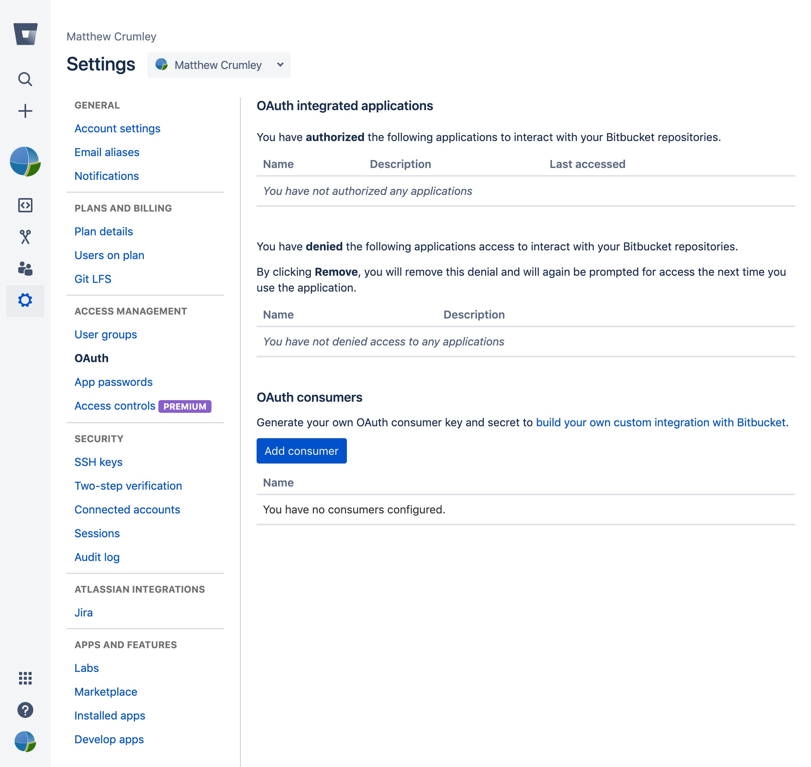

# Bitstats
Bitstats is a tool for extracting Bitbucket PR and Git repository activity.

## Objectives

  - **Fetch** repository and pull request data using the Bitbucket API.
  - **Cache** information to disk for fast queries.
  - **Export** tabular data for analysis using other tools.

## Usage
Bit Stats is a command line tool used similar to Git. Commands will sometimes have sub-commands and those could have options. To get going you first need to setup Bitbucket so you can use its API.

### Bitbucket Setup
  1. Go to the **Bitbucket settings** page located in the drop down menu by your avatar. Click the **OAuth** link under the **Access Management** heading.

    

  2. Click the **Add consumer** button. You can call this consumer whatever you'd like. Permissions should be *at least* set to **Read**.

    

  3. Use the **key** and **secret** for your consumer for the next step.

    
    
### Bitstats Setup
You should now have a Bitbucket consumer key and secret. 

  1. Run the `creds` sub-command with the `-s` option to set your credentails.

         ./bitstats setup creds -s
         
  2. Run the `token` sub-command to fetch your API token.

         ./bitstats setup token

You are now ready to interact with Bitstats!
