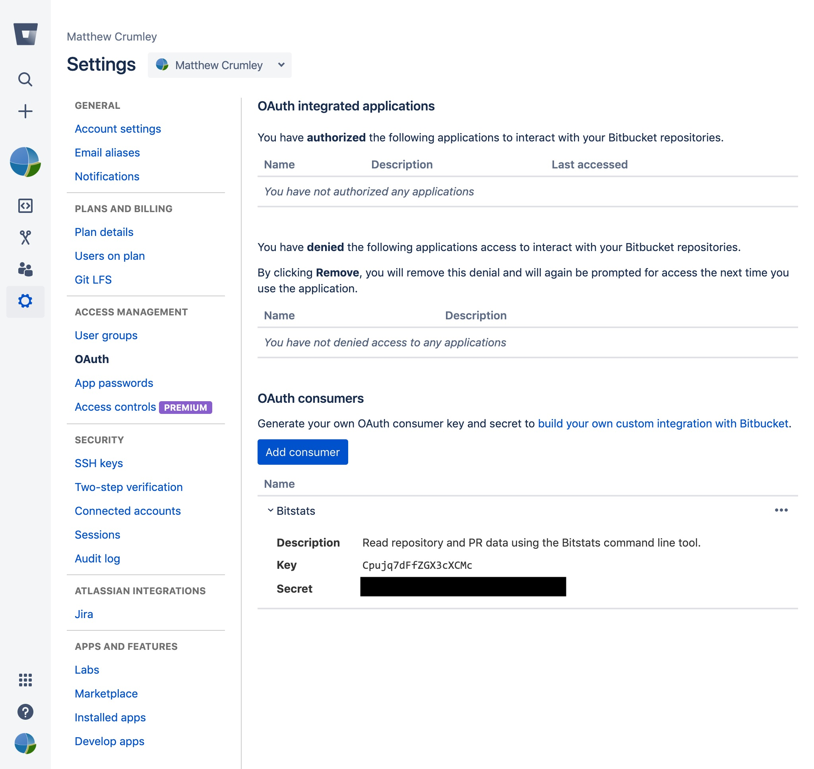

# Bitstats
Bitstats is a tool for extracting Bitbucket pull requests and related activity.

## Objectives

  - **Fetch** repository and pull request data using the Bitbucket API.
  - **Cache** information to disk for incremental updates and fast exports.
  - **Export** tabular data for analysis using other tools.

## Usage
Bit Stats is a command line tool used similar to Git. Commands will sometimes have sub-commands and those could have options. To get going you first need to setup Bitbucket so you can use its API.

## Bitbucket Setup
  1. Go to the **Bitbucket settings** page located in the drop down menu by your avatar. Click the **OAuth** link under the **Access Management** heading.

    

  2. Click the **Add consumer** button. You can call this consumer whatever you'd like. Permissions should be *at least* set to **Read**.

    

  3. Use the **key** and **secret** for your consumer for the next step.

    

## Program Setup
You should now have a Bitbucket consumer key and secret. 

  1. Run the `creds` sub-command with the `-s` option to set your credentails.

         ./bitstats setup creds --set
         
  2. Run the `token` sub-command to fetch (and refresh) your API token.

         ./bitstats setup token

You are now ready to interact with Bitstats!

## Program Help
The easiest way to get help is by running Bitstats with no arguments

    ./bitstats

You'll get a list of sub-commands. Each of those sub-commands *also* provides help.

    ./bitstats help repo
    ./bitstats help pr
    ./bitstats pr help export

## Getting the Repository List
After establishing credentials using the `setup` command, you'll then need to fetch the current list of repositories.

    ./bitstats repo index

Repositories are created and sometimes removed. You'll occasionally want to run this command. To query your local list, try the `repo list` command.

## Getting Pull Request Data
The `pr` command is the core functionality of Bitstats. It fetches PR data for various scopes:

 - single repository
 - group of repositories (project)
 - all repositories (global)

Depending on your patience, you can also fetch the comment, commit, and approval activitiy. For example, to extract all data for all repositories in the "sysco" project:

    ./bitstats pr index sysco --comments --commits --approvals --project

**It's important to remember** all data fetched from Bitbucket is somehow *linked* to a pull request. The idea is that non-PR commits are not intended for production deployment. Right?

## Exporting Data
Data can be exported in the same scopes as the PR indexes. The resulting CSV file will include data from:

 - single repository
 - group of repositories (project)
 - all repositories (global)

Only data that's *requested and available* will be exported. For example, to export all the data for "sysco" projects including comments, commits, and approvals:

    ./bitstats pr export sysco --comments --commits --approvals --project

Look for your CSV files in the current working directory. 

## Analyzing Data
Bitstats is only used for fetching and exporting data. Other tools should be used to perform statistical analysis, filtering, sorting, and graphing.
